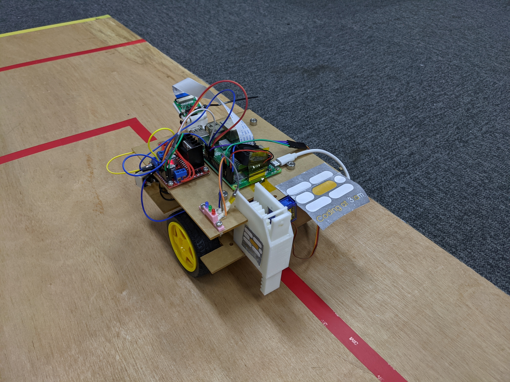
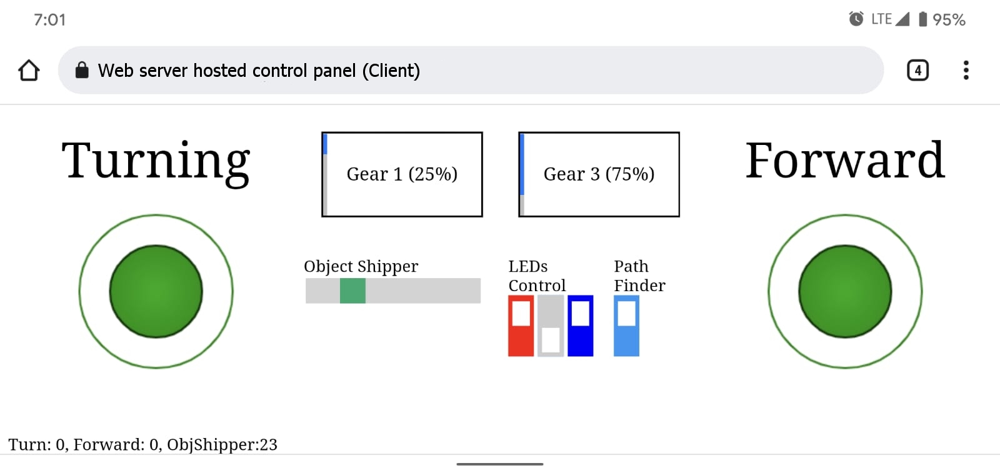

# ProJect-HAWS

    
    

 

ProJect HAWS is an automatic ~~(manually controlled)~~ vehicle designed to finish certain missions which include:

- Moving a ball shaped object between support stands
- Recognize number of triangles, circles and squares printed on an A4 paper
-  Follow a certain color of line on the ground

Parts used:
- Raspberry Pi 3B+
- Pi Cam 720p
- 2 x Gear Motor with Wheel
- 4 x 18650
- SG90 Servo
- LM2596
- Universal wheel
- 3 x Single color LED (R, G, B)
- L298N (we have homebrewed an H-Bridge but end up did not install on the vehicle)

Equipments used:
- 3D Printer
- Laser cutter

#### Remote Controller

The remote control system uses WebSocket over WiFi instead of Bluetooth, which needs a server to host the websocket nodejs application. By this method, data can travel between the vehicle and controller without LAN or deal with permission problem to use Bluetooth on phone. 
Vehicle Client (Python) <--> WebSocket Server (NodeJS) <--> Remote Controller Client (HTML)

    

#### Lifter

//TODO

#### Shape Recognition

[Python Code](./shapeCount.py)

#### Line following

//TODO
